# 📊 Diagramas de Fluxo - Sistema Mais Saúde LASAC

> Visualização dos principais fluxos de trabalho do sistema

---

## 📋 Índice

1. [Fluxo de Autenticação e Acesso](#1-fluxo-de-autenticação-e-acesso)
2. [Fluxo de Cadastro de Convênio (Admin/Gestor)](#2-fluxo-de-cadastro-de-convênio-admingestor)
3. [Fluxo de Cadastro Público](#3-fluxo-de-cadastro-público)
4. [Fluxo de Renovação de Convênio](#4-fluxo-de-renovação-de-convênio)
5. [Fluxo de Cadastro de Vendedor](#5-fluxo-de-cadastro-de-vendedor)
6. [Fluxo de Geração de Relatórios](#6-fluxo-de-geração-de-relatórios)
7. [Fluxo de Gerenciamento de Usuários (Admin)](#7-fluxo-de-gerenciamento-de-usuários-admin)
8. [Hierarquia de Permissões](#8-hierarquia-de-permissões)
9. [Relacionamento entre Entidades](#9-relacionamento-entre-entidades)

---

## 1. Fluxo de Autenticação e Acesso

### Diagrama: Processo de Login e Redirecionamento

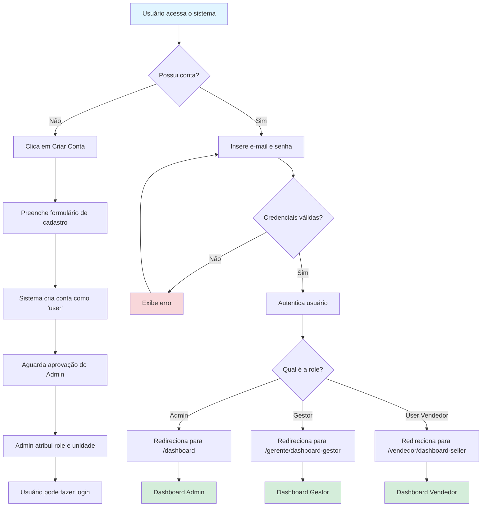

---

## 2. Fluxo de Cadastro de Convênio (Admin/Gestor)

### Diagrama: Cadastro Manual de Convênio

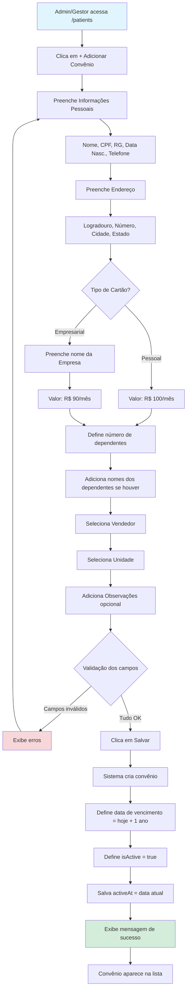

---

## 3. Fluxo de Cadastro Público

### Diagrama: Cliente cadastrando via link público

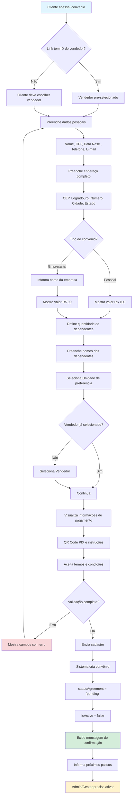

---

## 4. Fluxo de Renovação de Convênio

### Diagrama: Processo de Renovação

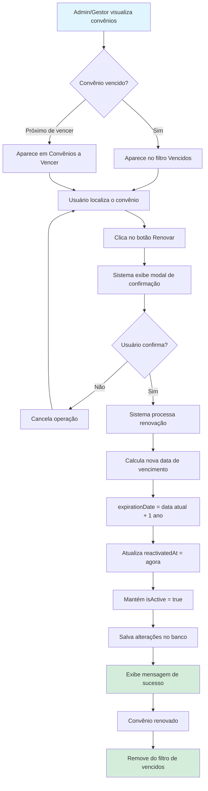

---

## 5. Fluxo de Cadastro de Vendedor

### Diagrama: Admin/Gestor cadastrando vendedor

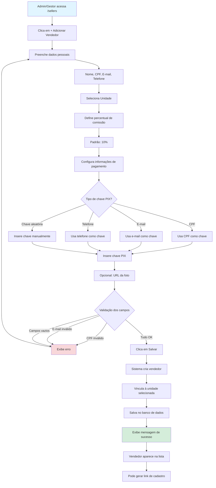

---

## 6. Fluxo de Geração de Relatórios

### Diagrama: Exportação de Relatórios

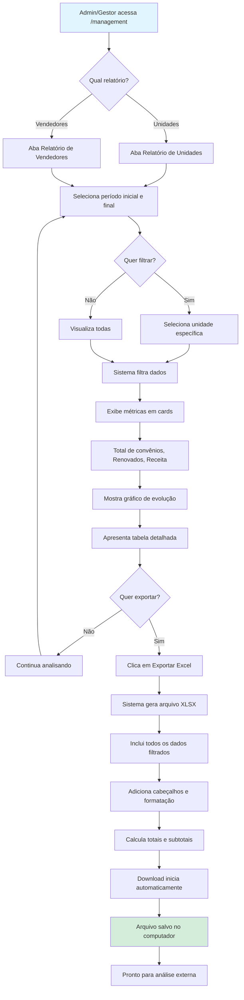

---

## 7. Fluxo de Gerenciamento de Usuários (Admin)

### Diagrama: Admin alterando role de usuário

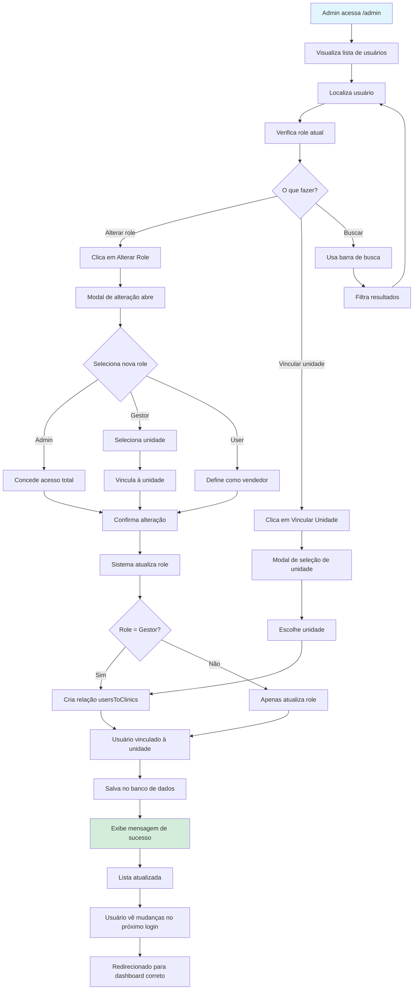

---

## 8. Hierarquia de Permissões

### Diagrama: Pirâmide de Acesso

```
                    👑 ADMINISTRADOR
                   /       |        \
                  /        |         \
           TODAS AS      TODOS      TODAS
           UNIDADES   VENDEDORES   FUNÇÕES
                 \        |        /
                  \       |       /
                   \      |      /
                    📋 GESTOR
                   /      |      \
                  /       |       \
            SUA UNIDADE  SEUS    FUNÇÕES
                        VENDEDORES LIMITADAS
                         \    |    /
                          \   |   /
                           \  |  /
                        💼 VENDEDOR
                           /   \
                          /     \
                    SEUS DADOS  SUAS
                              COMISSÕES
```

### Diagrama Mermaid: Estrutura de Permissões

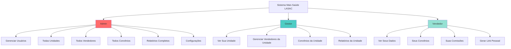

---

## 9. Relacionamento entre Entidades

### Diagrama: Estrutura do Banco de Dados

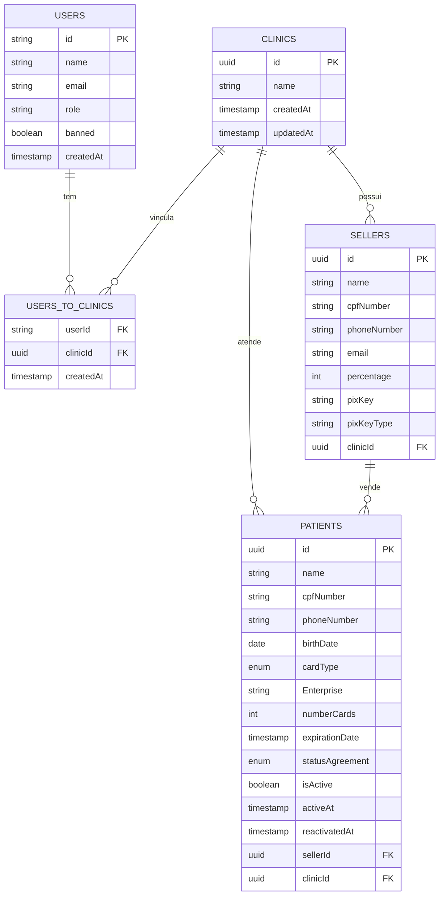

---

## 10. Fluxo de Dados no Dashboard

### Diagrama: Carregamento do Dashboard

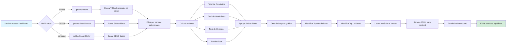

---

## 11. Fluxo de Busca e Filtros

### Diagrama: Sistema de Busca Inteligente

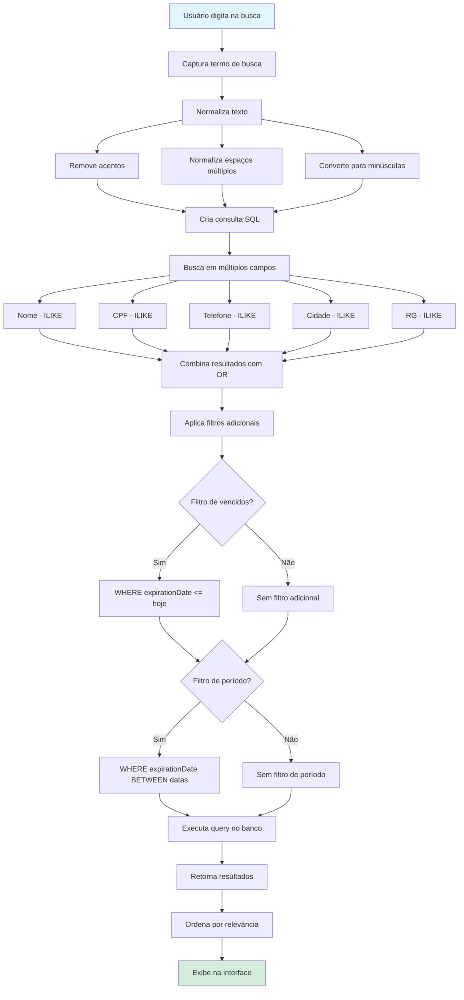

---

## 12. Ciclo de Vida de um Convênio

### Diagrama: Estados do Convênio

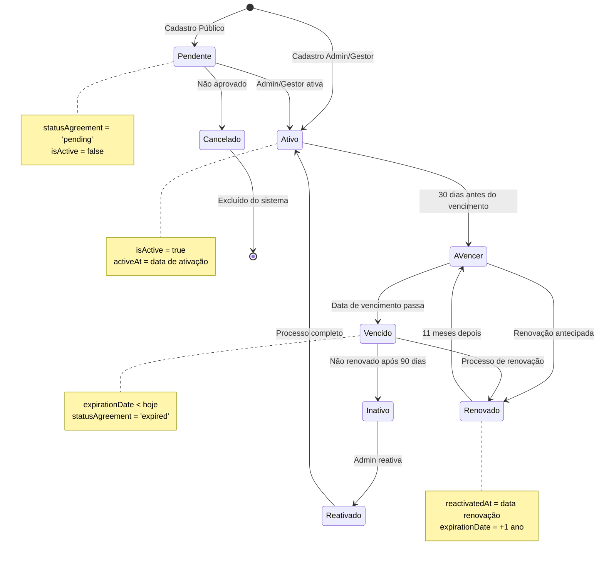

---

## 13. Fluxo de Comissões

### Diagrama: Cálculo de Comissões

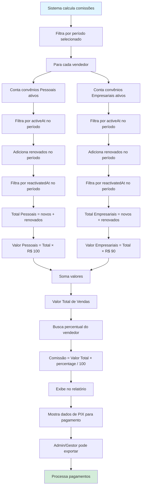

---

## 14. Fluxo de Link Personalizado

### Diagrama: Geração e Uso do Link

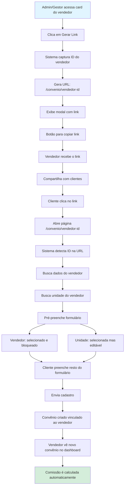

---

## 15. Mapa de Navegação do Sistema

### Diagrama: Estrutura de Páginas

```
Sistema Mais Saúde LASAC
│
├── 🔓 Público (Não autenticado)
│   ├── /authentication (Login/Cadastro)
│   ├── /convenio (Cadastro público)
│   └── /convenio/[vendedorId] (Cadastro com vendedor)
│
└── 🔐 Protegido (Autenticado)
    │
    ├── 👑 ADMIN
    │   ├── /dashboard
    │   ├── /patients (Convênios)
    │   ├── /sellers (Vendedores)
    │   ├── /clinics (Unidades)
    │   ├── /management (Relatórios)
    │   └── /admin (Gerenciar Usuários)
    │
    ├── 📋 GESTOR
    │   ├── /gerente/dashboard-gestor
    │   ├── /gerente/patients-gestor
    │   └── /gerente/sellers-gestor
    │
    └── 💼 VENDEDOR
        ├── /vendedor/dashboard-seller
        └── /vendedor/patients-seller
```

---

## 16. Timeline de um Dia Típico

### Para Administrador

```
08:00 ━━ Login no sistema
08:05 ━━ Verificar dashboard geral
08:15 ━━ Revisar novos cadastros pendentes
08:30 ━━ Aprovar/Ativar convênios
09:00 ━━ Verificar convênios a vencer (próximos 30 dias)
09:30 ━━ Contatar vendedores sobre renovações
10:00 ━━ Analisar relatórios do mês
11:00 ━━ Reunião com gestores
14:00 ━━ Cadastrar novos vendedores
15:00 ━━ Atualizar informações de pagamento
16:00 ━━ Exportar relatórios para contabilidade
17:00 ━━ Gerenciar usuários e permissões
18:00 ━━ Revisar métricas do dia e logout
```

### Para Gestor

```
08:00 ━━ Login no sistema
08:05 ━━ Verificar dashboard da unidade
08:15 ━━ Revisar convênios da unidade
08:30 ━━ Processar renovações pendentes
09:00 ━━ Contato com vendedores da equipe
10:00 ━━ Cadastrar novos convênios
11:00 ━━ Analisar performance dos vendedores
14:00 ━━ Atualizar dados de vendedores
15:00 ━━ Gerar relatório da unidade
16:00 ━━ Planejar ações para próxima semana
17:00 ━━ Revisar metas e logout
```

### Para Vendedor

```
08:00 ━━ Login no sistema
08:05 ━━ Verificar dashboard pessoal
08:15 ━━ Revisar comissões do mês
08:30 ━━ Verificar status dos convênios
09:00 ━━ Compartilhar link de cadastro
10:00 ━━ Acompanhar novos cadastros
11:00 ━━ Atualizar informações de contato
14:00 ━━ Prospectar novos clientes
16:00 ━━ Revisar métricas pessoais
17:00 ━━ Planejar metas e logout
```

---

## 📝 Como Usar Estes Diagramas

### Visualização

**Diagramas Mermaid:**

- Podem ser renderizados em GitHub, GitLab, VS Code (com extensão)
- Use visualizadores online como [Mermaid Live Editor](https://mermaid.live/)

**Diagramas ASCII:**

- Visualize diretamente em qualquer editor de texto
- Úteis para documentação rápida

### Integração no Manual

Adicione ao manual principal nas seções correspondentes:

```markdown
## Processo de Cadastro

Veja o fluxo completo no diagrama abaixo:

[Inserir diagrama aqui]

O processo segue os seguintes passos...
```

---

## 🎨 Legenda de Cores

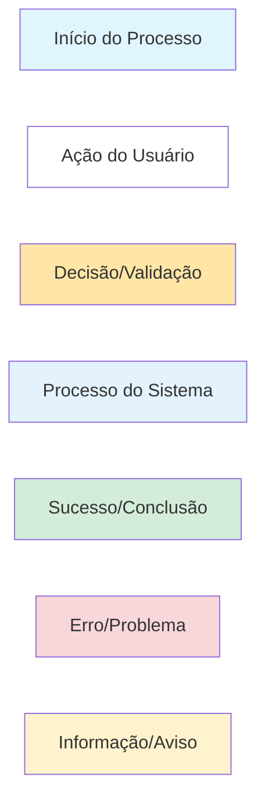

---

## 💡 Dicas para Leitura dos Diagramas

1. **Siga as setas** - Indicam o fluxo lógico
2. **Losangos** - Representam decisões/condições
3. **Retângulos** - Representam ações/processos
4. **Cores** - Indicam tipo de elemento (ver legenda)
5. **Linhas tracejadas** - Fluxos alternativos ou opcionais

---

**Versão:** 1.0  
**Data:** Novembro 2024  
**Sistema Mais Saúde LASAC**


